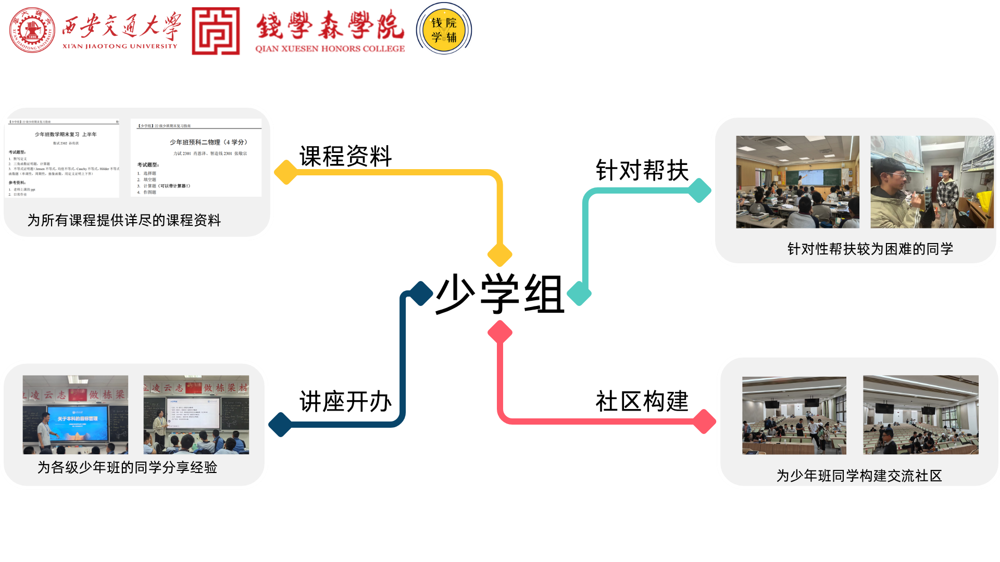

# 少学组介绍

少学组是钱院学辅下属的独立朋辈辅导团体，与钱学组、计学组、AI学组等并列，服务预科一和预科二的少年班学生。

少学组的志愿者团当然也都是由少年班毕业的各届优秀学长学姐组成，立志用自己的知识、经验与能力，为同在少年班就读的你排忧解难。

从预科一的学习方法、习惯养成、未来规划和阶段过渡，到预科二的资料分享、答疑帮扶、复习讲座、专业选择和食堂推荐，少学组开展的活动将会努力覆盖从预科一入学到预科二结束的各个阶段。

## 活动亮点

### 学习营

我们会举办学习营活动，帮助同学们更好地学习。

### 课程讲座

定期邀请优秀学长进行讲座，帮助同学们在预科阶段更好地学习。

### 资源分享

通过网站提供专业介绍、官方文件、经验分享和课程资料。
